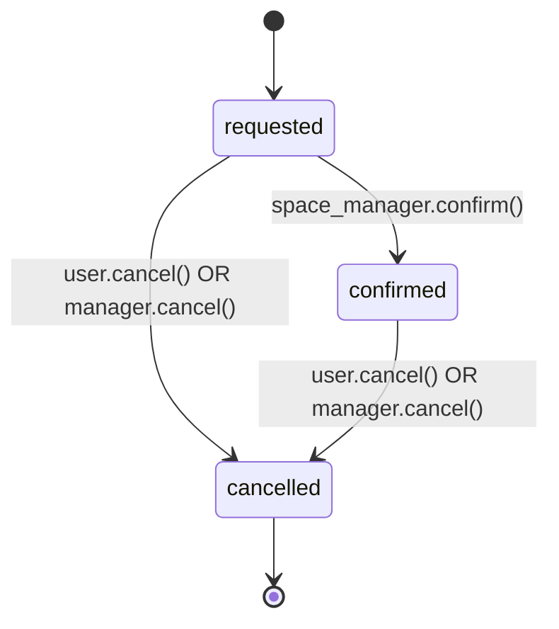

# Code Sets (Enumerations) - CoworkSpace Booking System

**Дата:** 2025-01-15  
**Версія:** 1.0  
**Принцип:** Машинні коди, стабільність, еволюція без breaking changes

---

## 1. booking_status

**Опис:** Статуси життєвого циклу бронювання.

**Тип:** Enum (VARCHAR(20))

**Значення:**

| Code        | UI Label (приклад)   | Description                                                     | Since Version |
| ----------- | -------------------- | --------------------------------------------------------------- | ------------- |
| `requested` | Очікує підтвердження | Бронювання створено користувачем, чекає підтвердження менеджера | 1.0           |
| `confirmed` | Підтверджено         | Менеджер підтвердив бронювання                                  | 1.0           |
| `cancelled` | Скасовано            | Бронювання скасовано користувачем або менеджером                | 1.0           |

### State Machine (граф переходів)

```
Initial State: requested
```



**Дозволені переходи:**

| From        | To          | Trigger       | Actor                              | Validation                             |
| ----------- | ----------- | ------------- | ---------------------------------- | -------------------------------------- |
| `requested` | `confirmed` | Підтвердження | space_manager                      | timeslot ще не минув                   |
| `requested` | `cancelled` | Скасування    | meeting_organizer OR space_manager | -                                      |
| `confirmed` | `cancelled` | Скасування    | meeting_organizer OR space_manager | -                                      |
| `cancelled` | -           | -             | -                                  | **Кінцевий стан, переходи заборонені** |

**Автоматичні дії при переходах:**

```javascript
// requested → confirmed
onTransition("requested", "confirmed", (booking) => {
  booking.updated_at = NOW();
  emitEvent("booking_confirmed", booking);
});

// * → cancelled
onTransition("*", "cancelled", (booking) => {
  booking.cancelled_at = NOW();
  booking.cancel_reason_code = provided_reason || null;
  booking.updated_at = NOW();
  invalidateCache(booking.timeslot_id);
  emitEvent("booking_cancelled", booking);
});
```

**Політика еволюції:**

- ✅ Додавання нового статусу: можливо (напр., `pending_payment`)
- ⚠️ Перейменування: breaking change, потрібна міграція
- ❌ Видалення: breaking change, використовувати deprecated замість

---

## 2. event_type

**Опис:** Типи подій для notification_events (outbox pattern).

**Тип:** Enum (VARCHAR(50))

**Значення:**

| Code                | Description              | Payload Structure                                                                 | Since Version |
| ------------------- | ------------------------ | --------------------------------------------------------------------------------- | ------------- |
| `booking_created`   | Нове бронювання створено | `{booking_id, confirmation_code, timeslot, masked_email}`                         | 1.0           |
| `booking_cancelled` | Бронювання скасовано     | `{booking_id, confirmation_code, cancelled_at, cancel_reason_code, masked_email}` | 1.0           |

**Майбутні розширення (v2.0):**

```
booking_confirmed     - Підтвердження менеджером
timeslot_reminder     - Нагадування за 24 години
timeslot_changed      - Зміна часу слоту менеджером
```

**Політика еволюції:**

- Нові event_type додаються без breaking changes
- Старі event_type не видаляються, помічаються як deprecated
- Payload структура може розширюватися (нові опціональні поля)

---

## 3. role

**Опис:** Ролі користувачів системи (users таблиця).

**Тип:** Enum (VARCHAR(50))

**Значення:**

| Code            | Description           | Permissions                                                            | Since Version |
| --------------- | --------------------- | ---------------------------------------------------------------------- | ------------- |
| `space_manager` | Менеджер коворкінгу   | Створення/редагування meeting_rooms, timeslots; підтвердження bookings | 1.0           |
| `admin`         | Адміністратор системи | Повний доступ до всіх ресурсів, управління users                       | 1.0           |

**Примітка:**

- `meeting_organizer` (E1 з DFD) **НЕ є роллю** в таблиці users
- meeting_organizer - анонімні користувачі, які бронюють через customer_email
- Вони не мають акаунту в системі (privacy-first)

**Майбутні розширення (v2.0):**

```
reception_staff  - Персонал reception, обмежений перегляд
accountant       - Доступ до звітності та аналітики
```

**Політика еволюції:**

- Нові ролі додаються з визначенням permissions
- Видалення ролі: тільки якщо немає users з цією роллю
- Перейменування: breaking change, потрібна міграція

---

## 4. cancel_reason_code

**Опис:** Причини скасування бронювання (для аналітики).

**Тип:** Enum (VARCHAR(50))

**Використання:** Опціонально заповнюється при booking_status = 'cancelled'

**Значення:**

| Code                | UI Label (приклад)  | Description                                          | Category     | Since Version |
| ------------------- | ------------------- | ---------------------------------------------------- | ------------ | ------------- |
| `user_request`      | Користувач скасував | Користувач сам вирішив скасувати бронювання          | User Action  | 1.0           |
| `room_unavailable`  | Кімната недоступна  | Переговорна кімната стала недоступною (ремонт, тощо) | System Issue | 1.0           |
| `schedule_conflict` | Конфлікт розкладу   | Виявлено конфлікт у розкладі                         | System Issue | 1.0           |
| `no_show`           | Не з'явився         | Користувач не з'явився на зустріч                    | User Action  | 1.0           |
| `admin_action`      | Дія адміністратора  | Скасовано адміністратором з адмін-причин             | Admin Action | 1.0           |

**Категорії для аналітики:**

- **User Action:** Ініційовано користувачем
- **System Issue:** Технічні або організаційні проблеми
- **Admin Action:** Ручне втручання адміністрації

**Майбутні розширення (v1.1):**

```
payment_failed       - Не вдалося провести оплату (якщо додамо payments)
duplicate_booking    - Виявлено дублікат бронювання
force_majeure        - Форс-мажорні обставини
```

**Статистика використання (приклад):**

```sql
SELECT cancel_reason_code, COUNT(*) as count
FROM bookings
WHERE booking_status = 'cancelled'
  AND cancelled_at >= '2025-01-01'
GROUP BY cancel_reason_code
ORDER BY count DESC;
```

**Політика еволюції:**

- Нові коди додаються вільно
- Deprecated коди зберігаються в БД, але не показуються в UI
- Mapping старих кодів на нові при необхідності

---

## 5. Політики еволюції кодів

### Принципи стабільності:

1. **Машинні коди:**

   - Використовуються у API, БД, логах
   - Не змінюються після релізу
   - snake_case, lowercase
   - Не містять UI-тексти

2. **UI-локалізація:**

   - Зберігається окремо (i18n файли, БД таблиця локалізації)
   - Може змінюватися без впливу на код
   - Множина мов підтримується

3. **Versioning:**
   - Кожен код має `Since Version`
   - Deprecated коди помічаються `Deprecated Version`

### Додавання нового коду:

```sql
-- 1. Додати в документацію (цей файл)
-- 2. Оновити CHECK constraint (якщо є)
ALTER TABLE bookings DROP CONSTRAINT IF EXISTS check_booking_status;
ALTER TABLE bookings ADD CONSTRAINT check_booking_status
CHECK (booking_status IN ('requested', 'confirmed', 'cancelled', 'pending_payment'));

-- 3. Додати UI-локалізацію
INSERT INTO i18n_labels (code, locale, label) VALUES
  ('booking_status.pending_payment', 'uk', 'Очікує оплати'),
  ('booking_status.pending_payment', 'en', 'Pending Payment');

-- 4. Оновити application код для обробки нового статусу
```

### Deprecation нового коду:

```markdown
| Code      | Status        | Deprecated Version | Replacement                |
| --------- | ------------- | ------------------ | -------------------------- |
| `no_show` | ⚠️ DEPRECATED | 2.0                | Use `user_no_show` instead |
```

**Mapping в коді:**

```javascript
const DEPRECATED_CODES = {
  no_show: "user_no_show",
};

function normalizeCode(code) {
  return DEPRECATED_CODES[code] || code;
}
```

### Breaking changes (уникати!):

**Приклад breaking change:** Перейменування `requested` → `pending`

**Міграційний шлях:**

```sql
-- Крок 1: Додати новий код без видалення старого
ALTER TABLE bookings ADD CONSTRAINT check_booking_status
CHECK (booking_status IN ('requested', 'pending', 'confirmed', 'cancelled'));

-- Крок 2: Міграція даних (може бути довгою!)
UPDATE bookings SET booking_status = 'pending' WHERE booking_status = 'requested';

-- Крок 3: Оновити всі API клієнти (може зайняти тижні/місяці)

-- Крок 4: Видалити старий код
ALTER TABLE bookings DROP CONSTRAINT check_booking_status;
ALTER TABLE bookings ADD CONSTRAINT check_booking_status
CHECK (booking_status IN ('pending', 'confirmed', 'cancelled'));
```

**Рекомендація:** Уникати breaking changes, використовувати aliases/mapping.

---

## 6. Validation Rules

### booking_status validation

**Backend (Python приклад):**

```python
BOOKING_STATUSES = {'requested', 'confirmed', 'cancelled'}

def validate_booking_status(status: str) -> bool:
    if status not in BOOKING_STATUSES:
        raise ValueError(f"Invalid booking_status: {status}")
    return True
```

**Backend (TypeScript приклад):**

```typescript
enum BookingStatus {
  REQUESTED = "requested",
  CONFIRMED = "confirmed",
  CANCELLED = "cancelled",
}

function validateBookingStatus(status: string): BookingStatus {
  if (!Object.values(BookingStatus).includes(status as BookingStatus)) {
    throw new Error(`Invalid booking_status: ${status}`);
  }
  return status as BookingStatus;
}
```

**Database validation:**

```sql
ALTER TABLE bookings ADD CONSTRAINT check_booking_status
CHECK (booking_status IN ('requested', 'confirmed', 'cancelled'));
```

---

## 7. Error Codes для невалідних enum значень

| Scenario                      | Error Code           | HTTP Status | Message Example                                                                      |
| ----------------------------- | -------------------- | ----------- | ------------------------------------------------------------------------------------ |
| Невалідний booking_status     | `invalid_enum_value` | 400         | "Invalid booking_status: 'pending'. Allowed: requested, confirmed, cancelled"        |
| Невалідний event_type         | `invalid_enum_value` | 400         | "Invalid event_type: 'booking_updated'. Allowed: booking_created, booking_cancelled" |
| Невалідний role               | `invalid_enum_value` | 400         | "Invalid role: 'guest'. Allowed: space_manager, admin"                               |
| Невалідний cancel_reason_code | `invalid_enum_value` | 400         | "Invalid cancel_reason_code: 'test'. Allowed: user_request, room_unavailable, ..."   |

**Response Structure:**

```json
{
  "error_code": "invalid_enum_value",
  "message": "Invalid booking_status value",
  "details": {
    "field": "booking_status",
    "provided_value": "pending",
    "allowed_values": ["requested", "confirmed", "cancelled"]
  }
}
```

---

## 8. Testing Enums

### Unit Tests:

```javascript
describe("booking_status enum", () => {
  test("should accept valid status", () => {
    expect(validateBookingStatus("requested")).toBe(true);
    expect(validateBookingStatus("confirmed")).toBe(true);
    expect(validateBookingStatus("cancelled")).toBe(true);
  });

  test("should reject invalid status", () => {
    expect(() => validateBookingStatus("pending")).toThrow(
      "invalid_enum_value"
    );
    expect(() => validateBookingStatus("REQUESTED")).toThrow(
      "invalid_enum_value"
    ); // case-sensitive
  });

  test("should allow valid transitions", () => {
    expect(canTransition("requested", "confirmed")).toBe(true);
    expect(canTransition("requested", "cancelled")).toBe(true);
    expect(canTransition("confirmed", "cancelled")).toBe(true);
  });

  test("should reject invalid transitions", () => {
    expect(canTransition("cancelled", "confirmed")).toBe(false);
    expect(canTransition("confirmed", "requested")).toBe(false);
  });
});
```

---

## 9. Documentation для API Consumers

**OpenAPI Specification (приклад):**

```yaml
components:
  schemas:
    BookingStatus:
      type: string
      enum:
        - requested
        - confirmed
        - cancelled
      description: |
        Статус бронювання:
        - `requested`: Очікує підтвердження менеджера
        - `confirmed`: Підтверджено
        - `cancelled`: Скасовано (кінцевий стан)
      example: requested

    CancelReasonCode:
      type: string
      enum:
        - user_request
        - room_unavailable
        - schedule_conflict
        - no_show
        - admin_action
      nullable: true
      description: Причина скасування (опціонально)
```

---

## 10. Моніторинг використання кодів

### Метрики для відстеження:

```sql
-- Розподіл статусів бронювань
SELECT booking_status, COUNT(*) as count,
       ROUND(100.0 * COUNT(*) / SUM(COUNT(*)) OVER(), 2) as percentage
FROM bookings
GROUP BY booking_status;

-- Топ причин скасування
SELECT cancel_reason_code, COUNT(*) as count
FROM bookings
WHERE booking_status = 'cancelled'
  AND cancel_reason_code IS NOT NULL
GROUP BY cancel_reason_code
ORDER BY count DESC;

-- Conversion rate: requested → confirmed
SELECT
  SUM(CASE WHEN booking_status = 'confirmed' THEN 1 ELSE 0 END) as confirmed,
  SUM(CASE WHEN booking_status = 'requested' THEN 1 ELSE 0 END) as requested,
  SUM(CASE WHEN booking_status = 'cancelled' THEN 1 ELSE 0 END) as cancelled,
  ROUND(100.0 * SUM(CASE WHEN booking_status = 'confirmed' THEN 1 ELSE 0 END) /
        NULLIF(SUM(CASE WHEN booking_status IN ('confirmed','cancelled') THEN 1 ELSE 0 END), 0), 2) as confirmation_rate
FROM bookings
WHERE created_at >= NOW() - INTERVAL '30 days';

-- Використання event_type
SELECT event_type, COUNT(*) as count
FROM notification_events
WHERE created_at >= NOW() - INTERVAL '7 days'
GROUP BY event_type;
```

**Алерти:**

- Якщо % cancelled > 30% → розслідувати причини
- Якщо user_request становить < 50% cancel_reason → проблеми з системою
- Якщо confirmation_rate < 70% → менеджери не встигають підтверджувати

---

## 11. Internationalization (i18n)

### Структура локалізації:

**Окрема таблиця (рекомендовано для великих проєктів):**

```sql
CREATE TABLE enum_labels (
  enum_type VARCHAR(50) NOT NULL,
  enum_code VARCHAR(50) NOT NULL,
  locale VARCHAR(5) NOT NULL,
  label VARCHAR(255) NOT NULL,
  description TEXT,
  PRIMARY KEY (enum_type, enum_code, locale)
);

-- Приклад даних
INSERT INTO enum_labels VALUES
  ('booking_status', 'requested', 'en', 'Pending Approval', 'Waiting for manager confirmation'),
  ('booking_status', 'requested', 'uk', 'Очікує підтвердження', 'Чекає підтвердження менеджера'),
  ('booking_status', 'confirmed', 'en', 'Confirmed', 'Booking has been approved'),
  ('booking_status', 'confirmed', 'uk', 'Підтверджено', 'Бронювання схвалено'),
  ('booking_status', 'cancelled', 'en', 'Cancelled', 'Booking has been cancelled'),
  ('booking_status', 'cancelled', 'uk', 'Скасовано', 'Бронювання скасовано');
```

**JSON файли (для невеликих проєктів):**

```json
// locales/uk.json
{
  "booking_status": {
    "requested": "Очікує підтвердження",
    "confirmed": "Підтверджено",
    "cancelled": "Скасовано"
  },
  "cancel_reason_code": {
    "user_request": "Користувач скасував",
    "room_unavailable": "Кімната недоступна",
    "schedule_conflict": "Конфлікт розкладу",
    "no_show": "Не з'явився",
    "admin_action": "Дія адміністратора"
  }
}

// locales/en.json
{
  "booking_status": {
    "requested": "Pending Approval",
    "confirmed": "Confirmed",
    "cancelled": "Cancelled"
  },
  "cancel_reason_code": {
    "user_request": "User Cancelled",
    "room_unavailable": "Room Unavailable",
    "schedule_conflict": "Schedule Conflict",
    "no_show": "No Show",
    "admin_action": "Admin Action"
  }
}
```

**Використання:**

```javascript
// Backend
function getLabel(enumType, enumCode, locale = 'en') {
  return i18n[locale]?.[enumType]?.[enumCode] || enumCode;
}

// API Response
{
  "booking_id": "123",
  "status": "requested",
  "status_label": "Очікує підтвердження", // для UI
  "created_at": "2025-01-15T10:30:00Z"
}
```

---

## 12. Майбутні розширення (Roadmap)

### v1.1 (Q2 2025)

- `booking_status`: додати `pending_payment` для інтеграції платежів
- `cancel_reason_code`: додати `payment_failed`, `duplicate_booking`
- `event_type`: додати `booking_confirmed`, `timeslot_reminder`

### v2.0 (Q4 2025)

- `role`: додати `reception_staff`, `accountant`
- `booking_status`: додати `completed` для завершених зустрічей
- `event_type`: додати `timeslot_changed`, `booking_rescheduled`
- Нова таблиця `equipment_types` для обладнання кімнат

### Backwards Compatibility:

- Всі нові коди додаються без видалення старих
- API v1 підтримується мінімум 12 місяців після релізу v2
- Deprecated коди помічаються в документації але залишаються функціональними

---

## 13. Code Review Checklist

При додаванні нового enum коду:

- [ ] Код у snake_case, lowercase
- [ ] Код не містить UI-тексти
- [ ] Додано в цей документ (13-code-sets.md)
- [ ] Додано в DB CHECK constraint (якщо є)
- [ ] Додано UI-локалізацію (uk + en мінімум)
- [ ] Оновлено OpenAPI specification
- [ ] Додано unit tests
- [ ] Додано в validation функції backend
- [ ] Перевірено зворотну сумісність
- [ ] Оновлено traceability документацію
- [ ] Код не конфліктує з deprecated кодами

---

## 14. Reference Implementation

### TypeScript Types:

```typescript
// types/enums.ts
export enum BookingStatus {
  REQUESTED = "requested",
  CONFIRMED = "confirmed",
  CANCELLED = "cancelled",
}

export enum EventType {
  BOOKING_CREATED = "booking_created",
  BOOKING_CANCELLED = "booking_cancelled",
}

export enum Role {
  SPACE_MANAGER = "space_manager",
  ADMIN = "admin",
}

export enum CancelReasonCode {
  USER_REQUEST = "user_request",
  ROOM_UNAVAILABLE = "room_unavailable",
  SCHEDULE_CONFLICT = "schedule_conflict",
  NO_SHOW = "no_show",
  ADMIN_ACTION = "admin_action",
}

// Validation
export function isValidBookingStatus(status: string): status is BookingStatus {
  return Object.values(BookingStatus).includes(status as BookingStatus);
}

// Transitions
const ALLOWED_TRANSITIONS: Record<BookingStatus, BookingStatus[]> = {
  [BookingStatus.REQUESTED]: [BookingStatus.CONFIRMED, BookingStatus.CANCELLED],
  [BookingStatus.CONFIRMED]: [BookingStatus.CANCELLED],
  [BookingStatus.CANCELLED]: [],
};

export function canTransition(from: BookingStatus, to: BookingStatus): boolean {
  return ALLOWED_TRANSITIONS[from]?.includes(to) ?? false;
}
```

### Python Types:

```python
# types/enums.py
from enum import Enum
from typing import Set

class BookingStatus(str, Enum):
    REQUESTED = "requested"
    CONFIRMED = "confirmed"
    CANCELLED = "cancelled"

class EventType(str, Enum):
    BOOKING_CREATED = "booking_created"
    BOOKING_CANCELLED = "booking_cancelled"

class Role(str, Enum):
    SPACE_MANAGER = "space_manager"
    ADMIN = "admin"

class CancelReasonCode(str, Enum):
    USER_REQUEST = "user_request"
    ROOM_UNAVAILABLE = "room_unavailable"
    SCHEDULE_CONFLICT = "schedule_conflict"
    NO_SHOW = "no_show"
    ADMIN_ACTION = "admin_action"

# Transitions
ALLOWED_TRANSITIONS = {
    BookingStatus.REQUESTED: {BookingStatus.CONFIRMED, BookingStatus.CANCELLED},
    BookingStatus.CONFIRMED: {BookingStatus.CANCELLED},
    BookingStatus.CANCELLED: set()
}

def can_transition(from_status: BookingStatus, to_status: BookingStatus) -> bool:
    return to_status in ALLOWED_TRANSITIONS.get(from_status, set())
```

---

## 15. Automated Tests для еволюції

```javascript
// Перевірка що нові коди не breaking existing
describe("Enum evolution", () => {
  test("should support all v1.0 booking_status codes", () => {
    const v1_codes = ["requested", "confirmed", "cancelled"];
    v1_codes.forEach((code) => {
      expect(isValidBookingStatus(code)).toBe(true);
    });
  });

  test("deprecated codes should be mapped correctly", () => {
    // Якщо в майбутньому deprecated 'no_show' → 'user_no_show'
    const deprecated = "no_show";
    const replacement = "user_no_show";

    expect(normalizeCode(deprecated)).toBe(replacement);
  });

  test("should maintain transition graph integrity", () => {
    // Requested повинен мати вихідні переходи
    expect(ALLOWED_TRANSITIONS["requested"].length).toBeGreaterThan(0);

    // Cancelled не повинен мати вихідних переходів
    expect(ALLOWED_TRANSITIONS["cancelled"].length).toBe(0);
  });
});
```

---

**Кінець Code Sets Documentation**

---

## Summary

Цей документ визначає всі enum-коди системи CoworkSpace Booking з:

✅ Машинними кодами (snake_case, стабільні)  
✅ State machines для booking_status  
✅ Політиками еволюції (додавання без breaking)  
✅ Локалізацією (окремо від кодів)  
✅ Валідацією на всіх рівнях (DB, APP, API)  
✅ Моніторингом та аналітикою  
✅ Roadmap для майбутніх розширень

**Принцип:** Коди - це контракт між системами, вони не змінюються. UI-тексти - це презентація, вони можуть змінюватися будь-коли.
